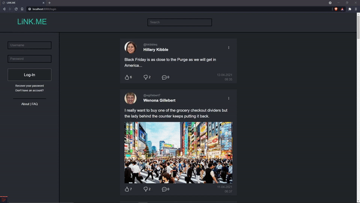

# FEUP-LBAW (Laboratório de Bases de Dados e Aplicações Web)

  

[Watch the full demo video](./docs/lbaw2145.mp4)

This project is a social media web application with features similar to Twitter and Facebook. It works on a Restful API, connecting a Laravel backend to an HTML, CSS and Javascript frontend interface. Docker was used for deployment.

Part of the project's goals was a focus on learning methodologies such as user stories management, requirements and wireframes.

## Members

| Name | Institutional Email |
| -------- | -------- |
| Nuno Resende | up201806825@fe.up.pt     |
| João Gonçalves | up201806796@fe.up.pt    |
| Xavier Pisco | up201806314@fe.up.pt     |
| Pedro Coelho |   up201806802@fe.up.pt   |

## Instructions

### Run with docker

docker run -it -p 8000:80 -e DB_DATABASE="lbaw2145" -e DB_USERNAME="lbaw2145" -e DB_PASSWORD="IK904155" lbaw2145/lbaw2145 

### URL

http://lbaw2145.lbaw-prod.fe.up.pt/

### Credentials

#### Normal user

username: xamas
password: password

#### Admin

username: zaphrak
password: safest
