# ER: Requirements Specification Component

In the middle of a pandemic, we wanted to provide a social network to link people, so that the distancing is only physical.

## A1: LiNK.ME

In an ever expanding society, we found it to be important for the people to be able to share their experiences and communicate with others with more quality. With the evolution of the pandemic, we believe it's important to be able to check up on your friends and acquaintences. LiNK.ME will be a social network of fast readability so that people that are working from home can check it on a quick break.

We want people to be linked.

When using this website, everyone will be able to read public posts and their comments, search for their favorite topics and people and register/log in with an email or a Google account. While logged in, they can write posts, comment posts, like or dislike posts, report posts and befriend other users in order to see their private posts and create groups with them. Post owners can edit and delete their own posts.
Administrators will be responsible for checking all the reports made on the posts and ban posts and users.

This website will have a responsive design in order to be easily used, regardless of the device, either for a quick pause on the computer or a coffee break on your phone.

---

## A2: Actors and User stories

In this artifact we will go deeper on the user profiles by describing its actors and on the main features by creating user stories. It will also contain the suplementary requirements for the development.

### 1. Actors

This topic will be a description of the actors of the website.

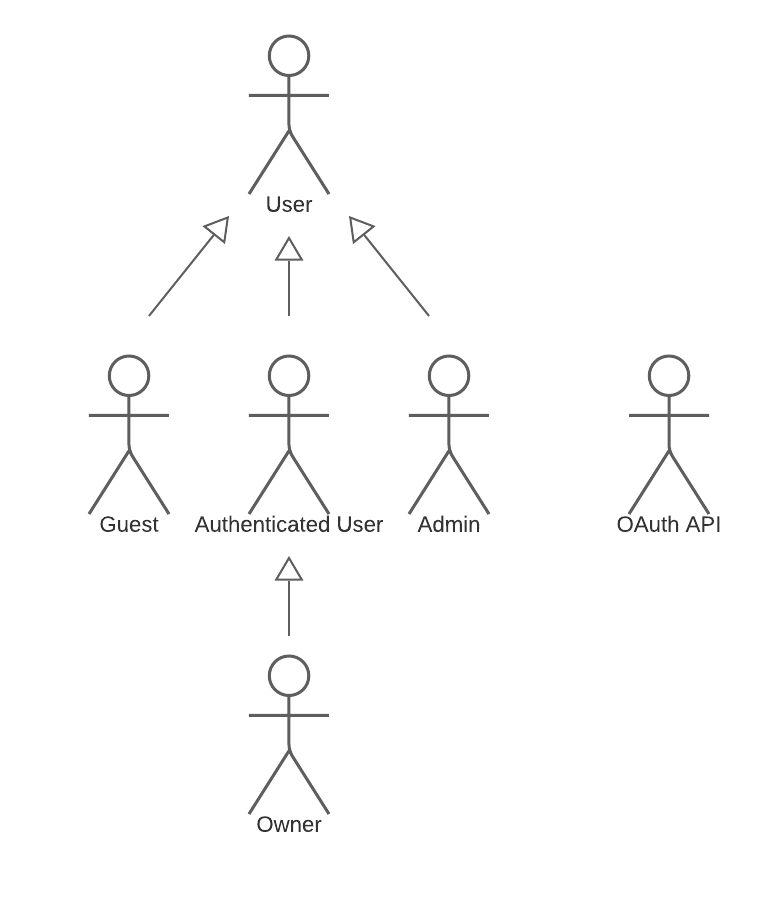

Figure 1: Actors

| Identifier 			| Description 	| Examples |
| -------- 				| -------- 		| -------- |
| User     				| Generic user of the website, has access to all the public posts.     		| N/A     |
| Guest     			| An unauthenticated user that can browse the site, only having access to public posts and profiles, not being able to like or comment.     		|  N/A     |
| Authenticated User     	| An authenticated user, has access to private profiles and private posts if he is friends with the post owner and he is also able to post on the site.     		| jlopes |
| Owner | An Authenticated User that has created a post and/or comment and that can modify it.| jlopes|
| Admin     			| An Authenticated user that is able to report posts and block certain accounts, serves as a moderator and supervisor of the website's proper functioning.     		| admin     |
| OAuth API|API used to refister/login via another website account.| Google OAuth API |

Table 1: Actor Descriptions

### 2. User Stories

Now we will present the user stories and group them by actor.

#### 2.1. User

|**Identifier**|**Name**|**Priority**|**Description**|
|-|-|-|-|
|US001|See Home Page|High|As a *User*, I want to see the home page, so that i can view a generic page from the website.|
|US002|Read Public Posts|High|As a *User*, I want to read public posts, so that I can keep up with public lives.|
|US003|See Public Profiles|High|As a *User*, I want to be able to read any public profile, so that I can learn more about that person.|
|US004|Read Public Comments|High|As a *User*, I want to be able to open the comments of a public post, so that I can read them.
|US005|Search Profiles|High|As a *User*, I want to be able to search for a specific profile, so that I can become friends with them and/or see their posts.
|US006|See About Page|High|As a *User*, I want to be able to see an about page, so that I can get some more information about the webapp and its creators.
|US007|See FAQ Page|High|As a *User*, I want to be able to see a FAQ page, so that I can easily get some answers about common questions on the webapp.
|US008|Search Posts|High|As a *User*, I want to be able to search for a specific post, so that I can read it and/or react to it.
|US009|Change Themes|Low|As a *User*, I want to be able to change the website' theme between light and dark modes, so that I can tweak it to have the best user experience possible.
|US010|Check edited|Low|As a *User*, I want to be able to see if a post was edited, so that he's aware that the post has been modified.|
|US011|Change Posts Order|Low|As a *User*, I want to change the order of the posts, so that I can view the posts however I want.|

Table 2: Users' user stories

#### 2.2. Guest

|**Identifier**|**Name**|**Priority**|**Description**|
|-|-|-|-|
|US101|Log in|High|As a *Guest*, I want to be able to log in, so that I can become a *Authenticated User*.|
|US102|Register|High|As a *Guest*, I want to be able to register, so that I can create an account to log into.|
|US103|Recover Password|High| As a *Guest*, I want to be able to recover my password, so that I can regain access to my account.|
|US104|Register via Google API|Low|As a *Guest*, I want to be able to register using my Google account, so that I can register more conveniently.|
|US105|Log in via Google API|Low|As a *Guest*, I want to be able to log in with my Google account, so that I can log in easily|

Table 3: Guests' user stories

#### 2.3. Authenticated User

|**Identifier**|**Name**|**Priority**|**Description**|
|-|-|-|-|
|US201|Post|High| As a *Authenticated User*, I want to be able create posts, so that the people I specify are able to see them.|
|US202|Comment|High| As a *Authenticated User*, I want to be able to comment a post, so that my opinion on that post is stated.|
|US203|Report|High| As a *Authenticated User*, I want to be able to report a post or a comment that I deem inappropriate, so that it can be reviewed.|
|US204|Like a post|High| As a *Authenticated User*, I want to be able to like a post, so that I can show my appreciation.|
|US205|Log out|High| As a *Authenticated User*, I want to be able to log out of my account, so that I can become a *Guest*.|
|US206|View/Edit own profile|High| As a *Authenticated User*, I want to be able to view and/or edit my profile, so that I can check and/or update the information on it.|
|US207|Delete Account|High| As a *Authenticated User*, I want to be able to delete my account, so that I can erase my data |
|US208|Send friend request|High| As a *Authenticated User*, I want to be able to send a friend request to someone, so that I can potentially become friends with them.|
|US209|See private posts|High| As a *Authenticated User*, I want to be able to see the posts of my friends, so that I can see what that person has been up to.|
|US210|Create a group|High| As a *Authenticated User*, I want to be able to create a group, so that I can share posts with only the people in that group.|
|US211|Add friends to a group|High| As a *Authenticated User*, I want to be able to add my friends to a group, so that they can become part of it.|
|US212|Like a comment|Medium| As a *Authenticated User*, I want to be able to like a comment, so that I can show my appreciation.|
|US213|Change Feed|Medium| As a *Authenticated User*, I want to have the option to choose my feed's protagonists, so that I can see posts from different people.|
|US214|Save a post to favorites|Low| As a *Authenticated User*, I want to be able to save a post that I like, so that I can see it again later.|

Table 4: Authenticated Users' user stories

#### 2.4. Owner
|**Identifier**|**Name**|**Priority**|**Description**|
|-|-|-|-|
|US301|Remove a post|Medium| As an *Owner* of a post, I want to be able to remove a post that I created, so that no one can see it again.|
|US302|Remove a comment|Medium| As an *Owner* of a comment, I want to be able to remove a comment of mine, so that no one can see it again.|
|US303|Edit a post|Low| As an *Owner* of a post, I want to be able to edit a post of mine, so that I can change it to my liking.|
|US304|Edit a comment|Low| As an *Owner* of a comment, I want to be able to edit a comment of mine, so that I can change it to my liking.|

Table 5: Owners' user stories

#### 2.5. Admin
|**Identifier**|**Name**|**Priority**|**Description**|
|-|-|-|-|
|US401|Delete other's post|High|As an *Admin*, I want to be able to delete other's posts, so that I can prevent inappropriate behaviour.
|US402| Delete other's comments|High|As an *Admin* I want to be able to delete other's comments, so that I can prevent inappropriate behaviour.
|US403|Ban users|Medium|As an *Admin* I want to be able to ban other users, so that I can keep the website user-friendly.

Table 6: Admins' user stories

### 3. Supplementary Requirements

In this topic we will present some requirements the system has.

#### 3.1. Business rules

| Identifier | Name | Description |
| -------- | -------- | -------- |
| BR01 | Ownership | A Authenticated User can only edit or delete its own posts.|
| BR02 | Post Date | A post's date must be in the past compared to the current date.|
| BR03 | Banned Account | No posts of a banned user will be visible |
| BR04 | Automatic Account Ban | An account will be banned after its 3rd banned post.|
| BR05 | Banned Posts | The banned post will not be visible for anyone.|
| BR06 | Text limit | The amount of characters you can write on a post is limited.|
| BR07 | Deleted Account | Posts from a deleted account will not be shown anywhere, all friendships are disbanded, all frienship requests are deleted and groups that include that account remain the same |

#### 3.2. Technical requirements

| Identifier | Name | Description |
| -------- | -------- | -------- |
|   **TR01**  | **Security**     | **The system should protect the users from known attacks and make use of a verification system on the login process.**     |
|   **TR02**  | **Access**     | **Users should be able to access the website in most devices and most browsers**     |
|   **TR03**  | **Availability**     | **The website must be online at least 95% of its lifespan.**     |
|   TR04  | Performance     | Pages on the website should not take more than 3 seconds to load.     |
|   TR05  | Web Application     | The system should be implemented as a Web application with dynamic pages.   |
|   TR06  | Portability     | The server-side should work on the most famous OSs.     |
|  TR07  | Usability     | The website should have a user-friendly design.     |
|   TR08  | Scalability     | The system should be able to support a large number of users and posts.     |

#### 3.3. Restrictions

| Identifier | Name | Descriptions |
| -------- | -------- | -------- |
| C01     | Deadline     | The system needs to be ready for deployment by 31/05/2021.    |
| C02 | Team Size | The system will be implemented by a group of 4 people.|

---

## A3: User Interface Prototype

In this artefact, we present an interactive prototype of the webapp to be developed, determining the main appearence, the architecture and a model of the main interactions with the system.
These are shown through site maps and wireflows for better understanding and a visual representation of the intended end-product.

### 1. Interface and common features

We used HTML, CSS and JS to implement this webapp and the user interface was made with the Bootstrap framework

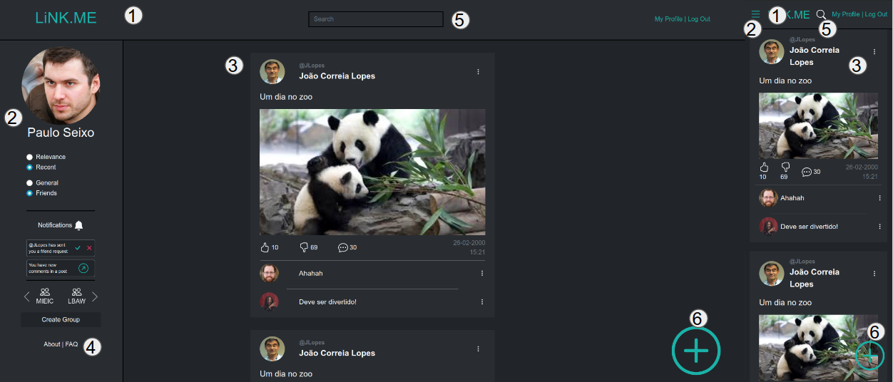

1. Navbar
2. Aside
3. Content
4. Footer
5. Search Bar
6. Create Post

This image shows the main page and the caracteristics that are part of most of the webapp.

- The navbar has the name of the app that can be used anytime to return to the main page.
- The aside is a bar that contains info related to the user and the current page he's on.
- The content is the main part of the page and where the content related to the current page appears

We decided to design the website in a dark theme to be easier on the eyes and because it contrasts well with the main color.

### 2. Sitemap

This sitemap shows the relationships between the various actions and pages, giving an idea of what will be possible and how the information is hierarcally structured.

Figure 2: Sitemap

### 3. Storyboards

In this topic we have a print of the whole wireflow for the project and a link to the invision project we developed.

Link to wireflow: https://projects.invisionapp.com/freehand/document/GVCuidQiX

### 4. Interfaces

The interfaces describe the user interactions and the main content of the web app, previewing the core features of the final's products different screens.

Implemented Pages:
- [UI01: Home](#ui01-home)
- [UI02: About](#ui02-about)
- [UI03: FAQ](#ui03-faq)
- [UI04: Login](#ui04-login)
- [UI05: Register](#ui05-register)
- [UI06: Post](#ui06-post)
- [UI07: My Profile](#ui07-my-profile)
- [UI08: Other's Profile](#ui08-others-profile)
- [UI09: Search](#ui09-search)
- [UI10: Create Group](#ui10-create-group)
- [UI11: Group](#ui11-group)
- [UI12: Admin](#ui12-admin)
- [UI13: Error](#ui13-error)

#### UI01: Home

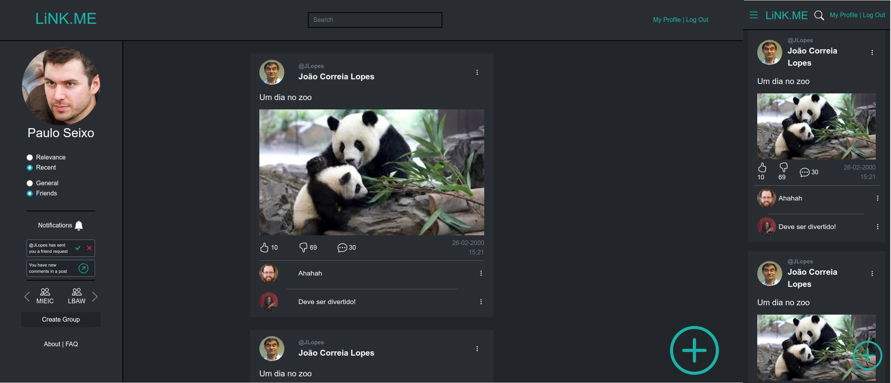

Figure 7: [Home Page](http://lbaw2145-piu.lbaw-prod.fe.up.pt/)

#### UI02: About

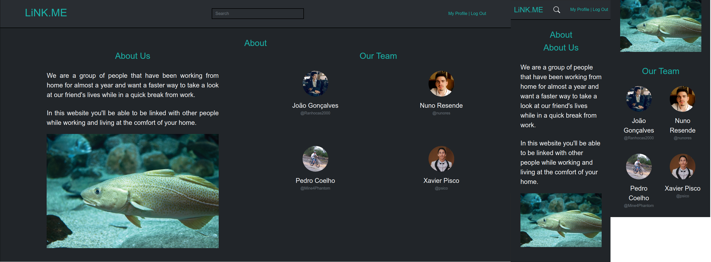

Figure 8: [About](http://lbaw2145-piu.lbaw-prod.fe.up.pt/about.php)

#### UI03: FAQ

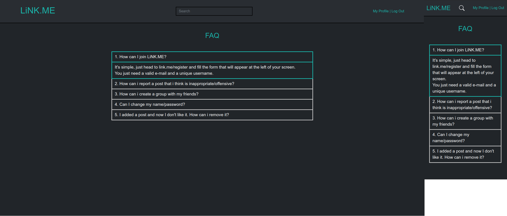

Figure 9: [FAQ](http://lbaw2145-piu.lbaw-prod.fe.up.pt/faq.php)

#### UI04: Login

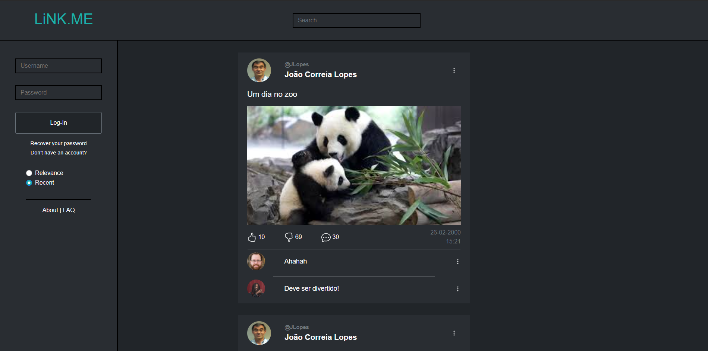

Figure 10: [Login](http://lbaw2145-piu.lbaw-prod.fe.up.pt/login.php)

#### UI05: Register

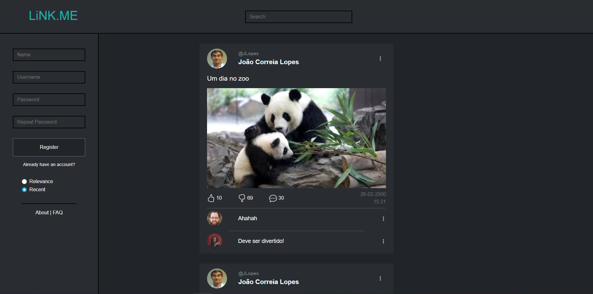

Figure 11: [Register](http://lbaw2145-piu.lbaw-prod.fe.up.pt/register.php)

#### UI06: Post

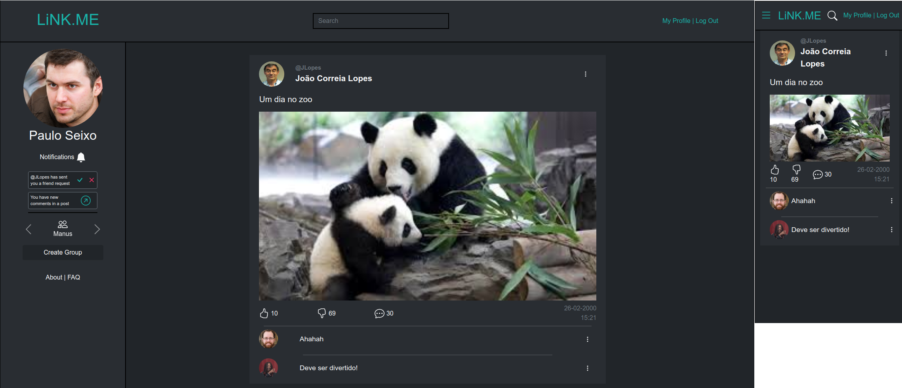

Figure 12: [Post](http://lbaw2145-piu.lbaw-prod.fe.up.pt/post_page.php)

#### UI07: My Profile

Figure 13: [My Profile](http://lbaw2145-piu.lbaw-prod.fe.up.pt/my_profile.php)

#### UI08: Other's Profile

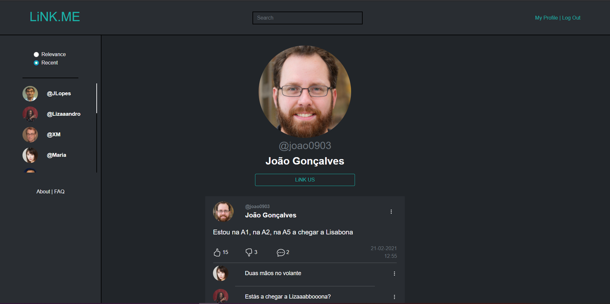

Figure 14: [Other's Profile](http://lbaw2145-piu.lbaw-prod.fe.up.pt/other_profile.php)

#### UI09: Search

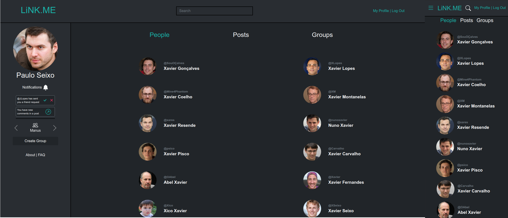

Figure 15: [Search](http://lbaw2145-piu.lbaw-prod.fe.up.pt/search_people.php)

#### UI10: Create Group

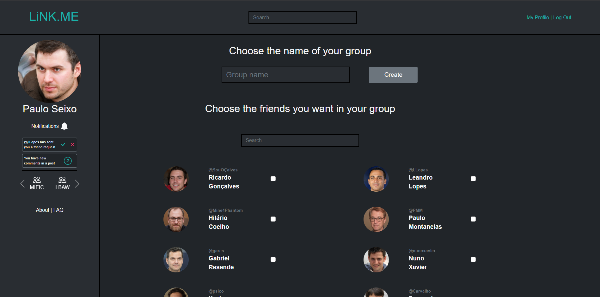

Figure 16: [Create Group](http://lbaw2145-piu.lbaw-prod.fe.up.pt/create_group.php)

#### UI11: Group

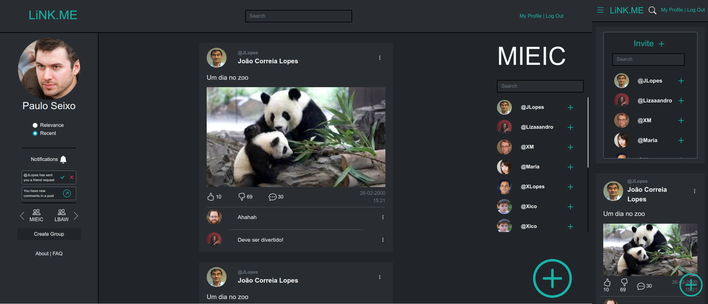

Figure 17: [Group](http://lbaw2145-piu.lbaw-prod.fe.up.pt/group_page.php)

#### UI12: Admin

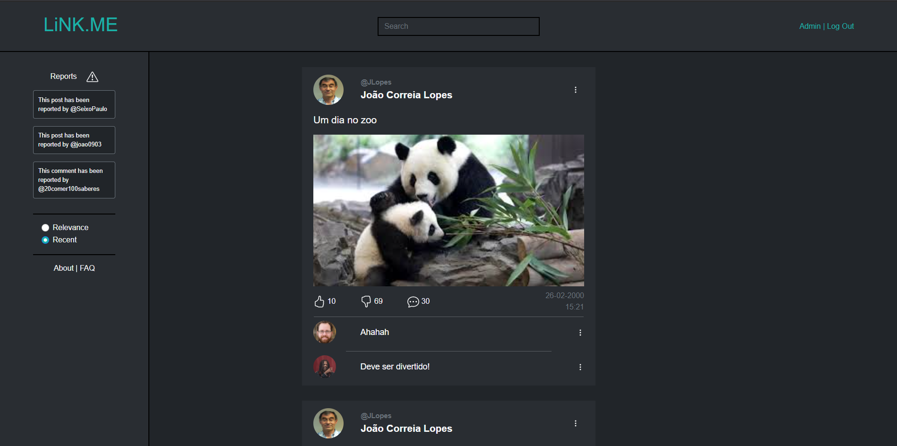

Figure 18: [Admin](http://lbaw2145-piu.lbaw-prod.fe.up.pt/admin.php)

#### UI13: Error

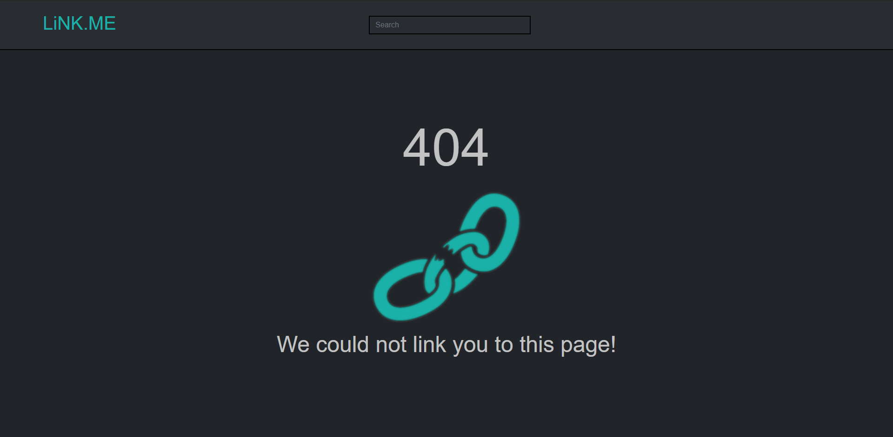

Figure 19: [Error](http://lbaw2145-piu.lbaw-prod.fe.up.pt/404.php)

---

## Revision history

***
GROUP2145, 16/03/2021

* João Miguel Gomes Gonçalves, up201806796@fe.up.pt
* Nuno Filipe Ferreira de Sousa Resende, up201806825@fe.up.pt
* Pedro Miguel Pires Coelho, up201806802@fe.up.pt
* Xavier Ruivo Pisco, up201806134@fe.up.pt (editor)